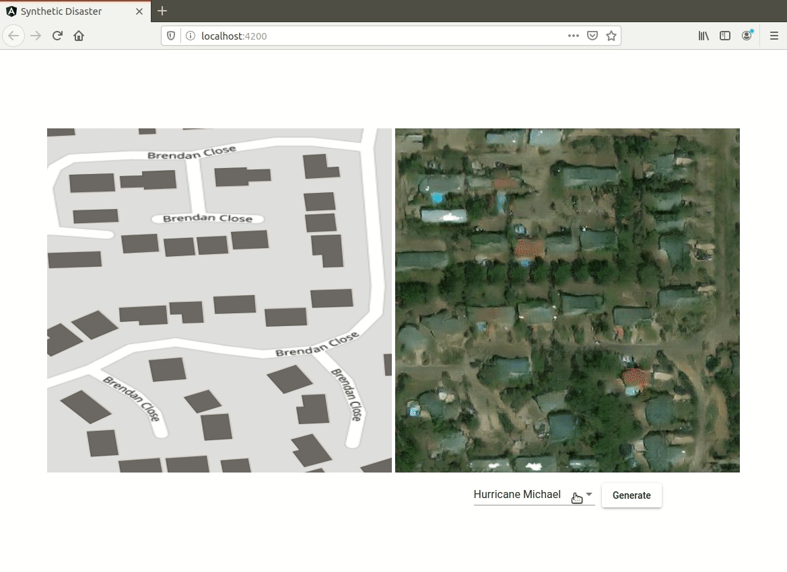
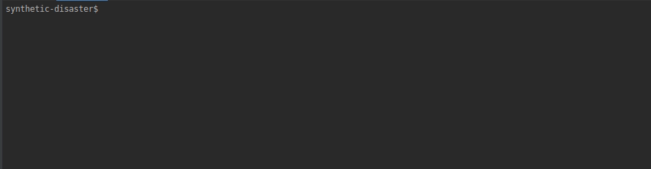

Generates synthetic satellite images of natural disasters using deep neural networks.




**Prerequisites**
---

+ Docker
+ docker-compose
+ git lfs


**Installation**
---

```
$ git lfs pull
$ docker-compose build
```




**Run Demo**
---

```
$ docker-compose up
```


**Acknowledgements**
---

 + [pix2pix paper](https://arxiv.org/abs/1611.07004)
 + [pix2pix implementation](https://github.com/znxlwm/pytorch-pix2pix)
